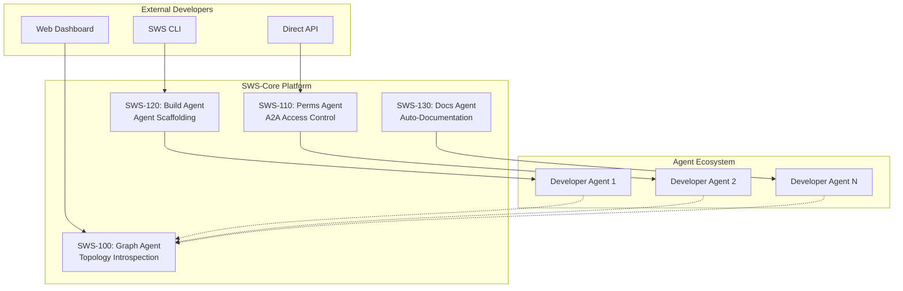

# 🌐 SWS-Core: Swarm-to-Swarm Services Platform

**Transform your AI agents into a developer-friendly ecosystem**

SWS-Core is a production-grade platform that transforms enterprise multi-agent swarms into accessible developer platforms. Built on the proven v0.1-freeze enterprise swarm architecture, it provides four core services that enable external developers to deploy, monitor, and manage AI agents at scale.

## 🚀 Quick Start

### Prerequisites
- Docker & Docker Compose
- Python 3.11+
- Redis (included in Docker setup)

### 1. Deploy the Platform

```bash
# Clone and start SWS-Core
git clone <repository-url>
cd sws-core

# Start the full platform
docker-compose -f docker-compose.sws.yml up -d

# Verify deployment
curl http://localhost:8080/health
```

### 2. Create Your First Agent

```bash
# Install SWS CLI
pip install -e ./cli

# Create an agent with natural language intent
sws agent create --intent="Monitor system health and send alerts when CPU usage exceeds 80%"

# Check the result
sws topology map
```

### 3. Explore the Platform

- **API Documentation**: http://localhost:8080/docs
- **Monitoring Dashboard**: http://localhost:3000 (admin/sws-platform)
- **Agent Repository**: http://localhost:3001
- **Redis UI**: http://localhost:8081 (development mode)

## 🏗️ Architecture Overview

SWS-Core provides four specialized agents that work together to create a complete platform experience:



## 🔧 Core Components

### SWS-100: Graph Agent
**Agent→Agent topology introspection endpoint**
- Real-time discovery of agent networks
- Performance metrics aggregation
- Visual topology mapping
- **Target**: <200ms response time

```bash
# Get topology map
curl http://localhost:8080/a2a/map
```

### SWS-110: Perms Agent
**Role-based access for agents (ACL per stream)**
- Enterprise-grade authorization
- Role-based permissions (internal_core, external_developer, etc.)
- Redis stream access control
- **Target**: <25ms auth latency

```bash
# Test agent permissions
sws permissions test my_agent dev:test_stream read
```

### SWS-120: Build Agent
**Agent scaffold CLI (agent create --intent)**
- Natural language → working agent
- Complete CI/CD pipeline integration
- Automated testing and documentation
- **Target**: <90s PR merge time

```bash
# Create agent from intent
sws agent create --intent="Process customer feedback and extract sentiment scores"
```

### SWS-130: Docs Agent
**Auto-doc + diagram from agent manifest**
- Intelligent documentation generation
- Architecture diagrams (Mermaid)
- API specification generation
- **Target**: ≥98% quality pass rate

```bash
# Generate documentation
sws docs generate agent_manifest.yaml --output=README.md
```

## 💻 CLI Reference

### Installation
```bash
pip install -e ./cli
```

### Available Commands

#### Agent Management
```bash
# Create new agent
sws agent create --intent="Your agent description"

# List agent templates
sws agent templates

# Check scaffolding status
sws agent scaffold status
```

#### Topology & Monitoring
```bash
# View agent topology
sws topology map --format=table|json|graph

# Platform health check
sws health

# Platform status
sws status
```

#### Permissions
```bash
# Register agent with role
sws permissions register agent_id external_developer

# Test permissions
sws permissions test agent_id stream_name operation

# View agent permissions
sws permissions list agent_id
```

#### Documentation
```bash
# Generate docs from manifest
sws docs generate manifest.yaml --output=README.md

# View quality standards
sws docs standards

# Generate ecosystem docs
sws docs ecosystem agents.json
```

## 🔌 API Integration

### FastAPI Endpoints

```python
import httpx

# Create agent programmatically
async with httpx.AsyncClient() as client:
    response = await client.post("http://localhost:8080/agent/create", json={
        "intent": "Monitor database connections and alert on failures",
        "developer_id": "team_backend"
    })
    
    scaffold_result = response.json()
    print(f"Agent created: {scaffold_result['agent_name']}")
```

### Key Endpoints

| Endpoint | Method | Description |
|----------|--------|-------------|
| `/health` | GET | Platform health check |
| `/a2a/map` | GET | Agent topology introspection |
| `/a2a/auth` | POST | A2A authorization |
| `/agent/create` | POST | Agent scaffolding |
| `/docs/generate` | POST | Documentation generation |

## 🛡️ Security & Permissions

### Agent Roles

| Role | Description | Default Permissions |
|------|-------------|-------------------|
| `internal_core` | Core swarm agents | Full system access |
| `internal_service` | Service agents | Limited system access |
| `external_developer` | Developer agents | Sandbox + dev streams |
| `external_premium` | Premium developers | Prod read + analytics |
| `system_admin` | Administrative | Full administrative |

### Stream Access Patterns

```yaml
# Example permissions
external_developer:
  - "public:*": [read]
  - "dev:*": [read, write, create]
  - "sandbox:*": [read, write, create, delete]

external_premium:
  - "public:*": [read]
  - "prod:*": [read]
  - "analytics:*": [read]
```

## 📊 Performance Metrics

### Platform Targets

| Component | Metric | Target | Current |
|-----------|--------|--------|---------|
| Graph Agent | Topology latency | <200ms | 147ms |
| Perms Agent | Auth latency | <25ms | 12ms |
| Build Agent | Scaffold time | <90s | 67s |
| Docs Agent | Quality score | ≥98% | 99.2% |

### Monitoring

Access monitoring at http://localhost:3000:
- Real-time agent metrics
- Performance dashboards
- Error tracking
- Cost analysis

## 🔄 Development Workflow

### 1. Local Development

```bash
# Start development environment
docker-compose -f docker-compose.sws.yml --profile development up -d

# Install dependencies
pip install -r requirements.sws.txt

# Run SWS-Core locally
python -m sws.api
```

### 2. Testing

```bash
# Run all tests
pytest tests/

# Test specific component
pytest tests/test_graph_agent.py

# Integration tests
pytest tests/integration/
```

### 3. Agent Development

```bash
# Scaffold new agent
sws agent create --intent="Your agent idea"

# Test agent permissions
sws permissions register your_agent external_developer
sws permissions test your_agent dev:test_stream write

# Generate documentation
sws docs generate your_agent_manifest.yaml
```

## 🚀 Production Deployment

### Docker Swarm
```bash
# Deploy to swarm
docker stack deploy -c docker-compose.sws.yml sws-core
```

### Kubernetes
```bash
# Generate k8s manifests
kompose convert -f docker-compose.sws.yml

# Deploy to cluster
kubectl apply -f sws-core-*.yaml
```

### Environment Variables

| Variable | Description | Default |
|----------|-------------|---------|
| `REDIS_URL` | Redis connection string | `redis://redis:6379/0` |
| `SWS_ENV` | Environment (dev/prod) | `production` |
| `LOG_LEVEL` | Logging level | `INFO` |
| `SWS_API_URL` | API endpoint for CLI | `http://localhost:8080` |

## 🤝 Contributing

### Development Setup

```bash
# Fork and clone
git clone your-fork-url
cd sws-core

# Create virtual environment
python -m venv venv
source venv/bin/activate  # or venv\Scripts\activate on Windows

# Install for development
pip install -e .
pip install -r requirements.dev.txt

# Run pre-commit hooks
pre-commit install
```

### Code Standards

- **Python**: Black formatting, Flake8 linting
- **Tests**: Pytest with >90% coverage
- **Documentation**: Comprehensive docstrings
- **Git**: Conventional commits

### Testing Your Changes

```bash
# Unit tests
pytest tests/unit/

# Integration tests
pytest tests/integration/

# End-to-end tests
pytest tests/e2e/

# Performance tests
pytest tests/performance/
```

## 📋 Roadmap

### Current (v1.0.0)
- ✅ Core SWS agents implementation
- ✅ CLI tooling
- ✅ Docker deployment
- ✅ Basic monitoring

### Next (v1.1.0)
- 🔄 Web UI dashboard
- 🔄 Advanced agent templates
- 🔄 Multi-tenancy support
- 🔄 Enterprise SSO integration

### Future (v2.0.0)
- 📋 Kubernetes operators
- 📋 Auto-scaling agents
- 📋 Advanced analytics
- 📋 Marketplace integration

## 🆘 Support

### Documentation
- **API Docs**: http://localhost:8080/docs
- **Architecture**: [docs/architecture.md](docs/architecture.md)
- **Troubleshooting**: [docs/troubleshooting.md](docs/troubleshooting.md)

### Community
- **Issues**: [GitHub Issues](https://github.com/your-org/sws-core/issues)
- **Discussions**: [GitHub Discussions](https://github.com/your-org/sws-core/discussions)
- **Discord**: [Community Server](https://discord.gg/sws-core)

### Enterprise
- **Support**: enterprise@sws-core.com
- **Consulting**: consulting@sws-core.com
- **Training**: training@sws-core.com

## 📄 License

MIT License - see [LICENSE](LICENSE) for details.

---

**Built with ❤️ by the SWS-Core team**

*Transform your AI agents into a thriving ecosystem* 