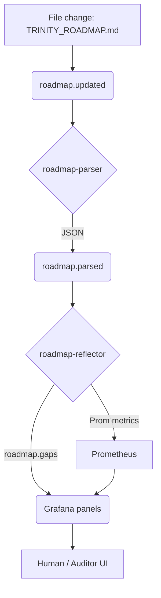

# 🔍 Trinity System Audit Guide

This guide walks you (or an autonomous auditor-agent) through a **full stack audit** of a running Trinity deployment.
It maps 1-to-1 onto the services and metrics already exposed, so every step can be scripted.

---

## 1. Infrastructure Audit

| Check | Command | Healthy Result |
|-------|---------|----------------|
| Docker daemon reachable | `docker info` | exit 0 |
| Compose services running | `docker compose ps` | all `STATE` = *running* |
| Networks present | `docker network inspect trinity_trinity-grid` | no error |

---

## 2. Core-Service Health

| Service | Port | Health Endpoint |
|---------|------|-----------------|
| NATS | 4222 / 8222 | `http://localhost:8222/` |
| Vault | 8200 | `curl http://localhost:8200/v1/sys/health` |
| Prometheus | 9090 | `/-/healthy` |
| Grafana | 3000 | Login page loads |

Automate with:
```bash
python ci/health_check_results/run_core_checks.py  # emits JSON + exits non-zero on failure
```

---

## 3. Roadmap Loop Verification

1. **Watcher** publishes `roadmap.updated` every time `TRINITY_ROADMAP.md` changes.  
   ```bash
   docker logs -f trinity-roadmap-watcher-1 | grep "published"
   ```
2. **Parser** converts to JSON → `roadmap.parsed`.  
   Verify:
   ```bash
   docker run --rm -it synadia/nats-box nats sub -s nats://host.docker.internal:4222 'roadmap.parsed'
   ```
3. **Reflector** emits gaps + Prom metrics.  
   ```bash
   curl -s localhost:9902/metrics | grep trinity_roadmap
   ```
4. Grafana dashboard "Roadmap Alignment" shows non-null lines.

---

## 4. Observability Sanity

* Prometheus target list is green (`/targets`).
* Loki "Explore" can query `{container=~"trinity-.*"}` and return logs.
* Grafana folders:
  * `Lumina Ops` – FastAPI & Council dashboards
  * `Trinity` – Roadmap & Gap dashboards

---

## 5. Security & Compliance Checks

| Area | Tool | Pass Criteria |
|------|------|---------------|
| Open ports | `nmap -p 1-10000 localhost` | only documented ports exposed |
| Container user | `docker inspect --format '{{.Config.User}}' <id>` | non-root |
| Secrets | `docker exec vault sh -c 'vault kv list secret/'` | all keys have TTL |

---

## 6. Automated Regression Audit

Run nightly via cron:
```bash
bash cron/nightly_improvement.sh  # builds, runs tests, updates TRINITY_ROADMAP.md
```
This triggers the full roadmap self-optimization cycle and records results under `health_check_results/`.

---

## 7. Incident-Response Script (panic mode)

```bash
./scripts/panic.sh  # gathers logs, metrics, roadmaps, compresses into panic_YYYYmmdd_HHMM.tgz
```
Send the tarball to `ops@trinity.local`.

---

## 8. Audit Dashboard Mermaid

The diagram below visualises the audit data flow; it is also embedded in the main README.

