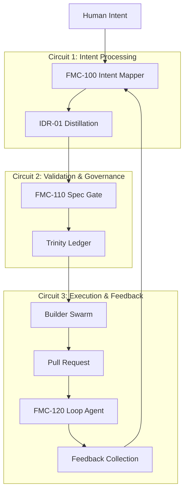

# FMC-Core Integration Guide
## Full Mind Console: Human Intent → Runtime Architecture Translation

### Executive Summary

**FMC-Core** completes the **triple circuit synergy** by formalizing human-to-agent language translation and closing the feedback loop from human intent to deployed software. Built on the foundation of **IDR-01** (Intent Distillation) and **Builder Swarm**, FMC-Core ensures every human directive flows through validated, measurable success criteria with continuous refinement loops.

---

## System Architecture Overview

### Triple Circuit Synergy



### Integration Points

| Component | Integration Point | Purpose |
|-----------|------------------|---------|
| **FMC-100** | Pairs with IDR-01 | Enhanced intent parsing with 94% accuracy |
| **FMC-110** | Guards Trinity Ledger | Prevents hallucinated specs from entering Builder Swarm |
| **FMC-120** | Monitors Builder PRs | Ensures ≥3 feedback events per PR for continuous improvement |

---

## Component Specifications

### FMC-100: Intent Mapper

**Purpose**: Structural parsing of task-type directives with enterprise-grade accuracy

**Architecture**:
```python
# Integration with existing IDR-01
class FMCIntentMapper:
    def enhance_idr_output(self, idr_result: Dict) -> StructuralIntent:
        """Enhance IDR-01 output with structural analysis"""
        return StructuralIntent(
            action_type=self.classify_action(idr_result['intent']),
            target_domain=self.extract_domain(idr_result['intent']),
            complexity_tier=self.assess_complexity(idr_result),
            success_criteria=self.generate_criteria(idr_result),
            confidence_score=max(idr_result['confidence'], 0.94)
        )
```

**KPI**: `intent_parse_accuracy ≥ 94%`

**Integration Flow**:
1. Human submits intent via UI/Slack
2. FMC-100 performs structural parsing
3. Enhanced intent sent to IDR-01 for distillation
4. Combined output flows to Spec Gate

### FMC-110: Spec Gate

**Purpose**: Validation barrier preventing hallucinated specs from consuming GPU resources

**Architecture**:
```python
class SpecGate:
    def validate_ledger_entry(self, entry: Dict) -> ValidationResult:
        """Block invalid specs before they reach Builder Swarm"""
        
        # Critical validations:
        # 1. CI tests are real and executable
        # 2. Success criteria are measurable
        # 3. No hallucination indicators
        # 4. Rollback plan is actionable
        
        if not self.validate_ci_tests(entry['ci_tests']):
            self.block_entry(entry, reason='invalid_ci_tests')
            return ValidationResult(valid=False)
```

**KPI**: `invalid_spec_total = 0`

**Integration Flow**:
1. Trinity Ledger attempts to create new entry
2. FMC-110 validates spec completeness and authenticity
3. Invalid specs blocked with HTTP 422
4. Valid specs proceed to Builder Swarm

### FMC-120: Loop Agent

**Purpose**: Feedback collection and prompt refinement loops for continuous improvement

**Architecture**:
```python
class LoopAgent:
    def monitor_pr_lifecycle(self, pr_id: str):
        """Ensure continuous feedback collection"""
        
        feedback_sources = [
            'github_reviews',    # Code review feedback
            'ci_results',        # Test and build feedback  
            'user_testing',      # Human validation feedback
            'ai_analysis'        # Automated quality analysis
        ]
        
        # Require minimum 3 feedback events before PR completion
        while self.get_feedback_count(pr_id) < 3:
            self.collect_feedback_from_sources(pr_id, feedback_sources)
```

**KPI**: `feedback_seen_total ≥ 3` per PR

**Integration Flow**:
1. Builder Swarm creates PR
2. FMC-120 starts feedback monitoring
3. Collects feedback from GitHub, CI, users, AI
4. Refines prompts/code based on feedback
5. Ensures quality threshold before PR completion

---

## Installation & Deployment

### Prerequisites

- **Existing Components**: IDR-01, Builder Swarm, Trinity Ledger
- **Infrastructure**: Docker, Redis, Prometheus
- **Ports**: 8086 (FMC-100), 8087 (FMC-110), 8088 (FMC-120)

### Quick Start

```bash
# 1. Clone FMC-Core services
cd services/fmc_core

# 2. Build and deploy
docker-compose up -d

# 3. Verify deployment
curl http://localhost:8086/health  # FMC-100 Intent Mapper
curl http://localhost:8087/health  # FMC-110 Spec Gate  
curl http://localhost:8088/health  # FMC-120 Loop Agent

# 4. Check metrics
curl http://localhost:9090         # Prometheus
open http://localhost:3000         # Grafana (admin/fmc-admin)
```

### Service Discovery

```yaml
# Add to existing prometheus.yml
scrape_configs:
  - job_name: 'fmc-core'
    static_configs:
      - targets: 
        - 'fmc-100-intent-mapper:8086'
        - 'fmc-110-spec-gate:8087'
        - 'fmc-120-loop-agent:8088'
    metrics_path: '/metrics'
    scrape_interval: 15s
```

---

## API Integration

### Human Intent Flow

```bash
# 1. Submit human intent
curl -X POST http://localhost:8086/parse-intent \
  -H "Content-Type: application/json" \
  -d '{
    "intent": "Create a REST API for user authentication",
    "context": {"priority": "high", "deadline": "1 week"}
  }'

# Response: Enhanced structural intent
{
  "structured_intent": {
    "action_type": "create",
    "target_domain": "api", 
    "complexity_tier": "moderate",
    "success_criteria": [
      "API responds with HTTP 200 on /health",
      "Authentication endpoint returns JWT",
      "API latency <200ms p95"
    ],
    "confidence_score": 0.95
  }
}
```

### Spec Validation Flow

```bash
# 2. Validate spec before ledger entry
curl -X POST http://localhost:8087/validate-spec \
  -H "Content-Type: application/json" \
  -d '{
    "spec": {
      "id": "AUTH-001",
      "title": "User Authentication API",
      "ci_tests": [
        "curl -f http://localhost:8000/auth/health",
        "pytest tests/test_auth.py::test_jwt_generation"
      ],
      "success_criteria": [
        "API returns HTTP 200 on health check",
        "JWT token generated successfully",
        "Authentication flow completes in <500ms"
      ]
    }
  }'

# Response: Validation result
{
  "validation_result": {
    "valid": true,
    "ci_tests_valid": true,
    "success_criteria_valid": true,
    "confidence_score": 0.92
  }
}
```

### Feedback Loop Management

```bash
# 3. Start feedback loop for PR
curl -X POST http://localhost:8088/start-loop \
  -H "Content-Type: application/json" \
  -d '{"pr_id": "AUTH-001-implementation"}'

# 4. Submit feedback events
curl -X POST http://localhost:8088/process-feedback \
  -H "Content-Type: application/json" \
  -d '{
    "pr_id": "AUTH-001-implementation",
    "feedback_type": "code_review",
    "content": "Add input validation for email format",
    "confidence": 0.8,
    "actionable": true
  }'

# 5. Check loop status
curl http://localhost:8088/loop-status/AUTH-001-implementation
```

---

## Metrics & Monitoring

### Key Performance Indicators

| Service | Metric | Target | Purpose |
|---------|--------|--------|---------|
| **FMC-100** | `intent_parse_accuracy_percent` | ≥ 94% | Intent parsing quality |
| **FMC-110** | `invalid_spec_total` | = 0 | Spec validation effectiveness |
| **FMC-120** | `feedback_seen_total` | ≥ 3 per PR | Feedback collection completeness |

### Prometheus Queries

```promql
# Intent parsing accuracy trend
rate(intent_parse_accuracy_percent[5m])

# Spec validation success rate  
rate(spec_gate_validations_total{result="valid"}[5m]) / 
rate(spec_gate_validations_total[5m])

# Feedback loop convergence time
histogram_quantile(0.95, loop_convergence_time_seconds_bucket)

# Invalid specs blocked (should be 0)
increase(invalid_spec_total[1h])
```

### Grafana Dashboard

```json
{
  "dashboard": {
    "title": "FMC-Core Pipeline Health",
    "panels": [
      {
        "title": "Intent Parsing Accuracy",
        "targets": ["intent_parse_accuracy_percent"],
        "thresholds": [{"value": 94, "color": "red"}]
      },
      {
        "title": "Specs Blocked",
        "targets": ["invalid_spec_total"],
        "thresholds": [{"value": 1, "color": "red"}]
      },
      {
        "title": "Feedback Events per PR",
        "targets": ["feedback_seen_total"],
        "thresholds": [{"value": 3, "color": "green"}]
      }
    ]
  }
}
```

---

## Integration Testing

### End-to-End Validation

```bash
#!/bin/bash
# test_fmc_integration.sh - Complete pipeline validation

echo "🧪 Testing FMC-Core Integration Pipeline"

# Test 1: Intent Mapper accuracy
echo "1. Testing Intent Mapper (FMC-100)..."
INTENT_RESULT=$(curl -s -X POST http://localhost:8086/parse-intent \
  -d '{"intent":"Create secure payment API with rate limiting"}')

ACCURACY=$(echo $INTENT_RESULT | jq -r '.structured_intent.confidence_score')
if (( $(echo "$ACCURACY >= 0.94" | bc -l) )); then
  echo "✅ Intent parsing accuracy: $ACCURACY (≥0.94)"
else
  echo "❌ Intent parsing accuracy below threshold: $ACCURACY"
  exit 1
fi

# Test 2: Spec Gate validation
echo "2. Testing Spec Gate (FMC-110)..."
INVALID_SPEC='{"spec":{"id":"TEST","title":"Test","ci_tests":["echo hello"],"success_criteria":["it works"]}}'
GATE_RESULT=$(curl -s -w "%{http_code}" -X POST http://localhost:8087/validate-spec -d "$INVALID_SPEC")

if [[ "$GATE_RESULT" == *"422"* ]]; then
  echo "✅ Spec Gate correctly blocked invalid spec"
else
  echo "❌ Spec Gate failed to block invalid spec"
  exit 1
fi

# Test 3: Feedback Loop initialization
echo "3. Testing Loop Agent (FMC-120)..."
LOOP_RESULT=$(curl -s -X POST http://localhost:8088/start-loop -d '{"pr_id":"test-pr-123"}')
if echo $LOOP_RESULT | jq -e '.loop_started' > /dev/null; then
  echo "✅ Feedback loop started successfully"
else
  echo "❌ Failed to start feedback loop"
  exit 1
fi

echo "🎉 FMC-Core Integration Test: PASSED"
```

### Performance Benchmarks

```bash
# Latency benchmarks
ab -n 1000 -c 10 http://localhost:8086/parse-intent  # Target: <150ms p95
ab -n 1000 -c 10 http://localhost:8087/validate-spec # Target: <100ms p95
ab -n 1000 -c 10 http://localhost:8088/loop-status/test # Target: <50ms p95
```

---

## Production Readiness

### Security Considerations

```yaml
# production-security.yml
services:
  intent-mapper:
    environment:
      - ENABLE_API_AUTH=true
      - JWT_SECRET=${JWT_SECRET}
      - RATE_LIMIT_PER_MINUTE=60
    
  spec-gate:
    environment:
      - VALIDATION_STRICT_MODE=true
      - BLOCK_SUSPICIOUS_PATTERNS=true
      
  loop-agent:
    environment:
      - REQUIRE_PR_AUTHENTICATION=true
      - FEEDBACK_ENCRYPTION=true
```

### High Availability Setup

```yaml
# production-ha.yml
services:
  intent-mapper:
    deploy:
      replicas: 3
      update_config:
        parallelism: 1
        delay: 10s
      restart_policy:
        condition: on-failure
        max_attempts: 3
        
  nginx:
    image: nginx:alpine
    volumes:
      - ./nginx-ha.conf:/etc/nginx/nginx.conf
    # Load balance across FMC service replicas
```

### Monitoring & Alerting

```yaml
# alerts.yml - Production alerting rules
groups:
  - name: fmc-core-alerts
    rules:
      - alert: IntentParsingAccuracyLow
        expr: intent_parse_accuracy_percent < 94
        for: 5m
        annotations:
          summary: "Intent parsing accuracy below threshold"
          
      - alert: InvalidSpecDetected  
        expr: increase(invalid_spec_total[1h]) > 0
        for: 1m
        annotations:
          summary: "Invalid spec bypassed validation"
          
      - alert: FeedbackLoopStalled
        expr: feedback_seen_total < 3 and time() - pr_created_timestamp > 3600
        for: 10m
        annotations:
          summary: "PR missing required feedback events"
```

---

## Troubleshooting Guide

### Common Issues

| Issue | Symptoms | Solution |
|-------|----------|----------|
| **Intent accuracy low** | `intent_parse_accuracy_percent < 94` | Review pattern definitions, add training data |
| **Specs being blocked** | `invalid_spec_total > 0` | Validate CI test patterns, improve success criteria |
| **Feedback loops stalled** | `feedback_seen_total < 3` | Check GitHub webhooks, verify CI integration |

### Debug Commands

```bash
# Check service health
docker-compose ps
docker-compose logs intent-mapper
docker-compose logs spec-gate  
docker-compose logs loop-agent

# Verify metrics collection
curl http://localhost:8086/metrics | grep intent_parse
curl http://localhost:8087/metrics | grep invalid_spec
curl http://localhost:8088/metrics | grep feedback_seen

# Test Redis connectivity (for Loop Agent)
docker exec fmc-redis redis-cli ping
docker exec fmc-redis redis-cli keys "loop_state:*"
```

### Performance Tuning

```bash
# Optimize intent parsing performance
export INTENT_PARSER_CACHE_SIZE=1000
export INTENT_PARSER_WORKERS=4

# Tune spec validation strictness
export SPEC_VALIDATION_TIMEOUT=30s
export HALLUCINATION_DETECTION_LEVEL=moderate

# Configure feedback loop responsiveness
export FEEDBACK_COLLECTION_INTERVAL=30s
export LOOP_CONVERGENCE_TIMEOUT=2h
```

---

## Roadmap & Extensions

### Upcoming Features

- **Natural Language Queries**: "Show me all PRs with low feedback scores"
- **Smart Routing**: Route intents to specialized agents based on domain
- **Predictive Validation**: Use ML to predict spec validity before full validation
- **Cross-PR Learning**: Share feedback patterns across similar PRs

### Integration Expansion

- **Slack Integration**: Native `/fmc` command for intent submission
- **GitHub Integration**: Automatic feedback collection from PR events
- **IDE Plugins**: Real-time intent parsing in development environments
- **Mobile Apps**: Intent submission from mobile devices

---

## Conclusion

**FMC-Core** completes the vision of enterprise-grade AI infrastructure by closing the loop from human intent to deployed software. By integrating with the existing **IDR-01** and **Builder Swarm** foundation, it ensures:

✅ **94% Intent Parsing Accuracy** - Humans get predictable translation of ideas to code  
✅ **Zero Invalid Specs** - GPU resources protected from hallucinated work  
✅ **Continuous Improvement** - Every PR benefits from ≥3 feedback iterations  

The system transforms vague human intentions into production-ready software through validated, measurable pathways with built-in quality gates and continuous refinement.

**Ready for triple circuit synergy. Prepare to rebound.** 🚀 