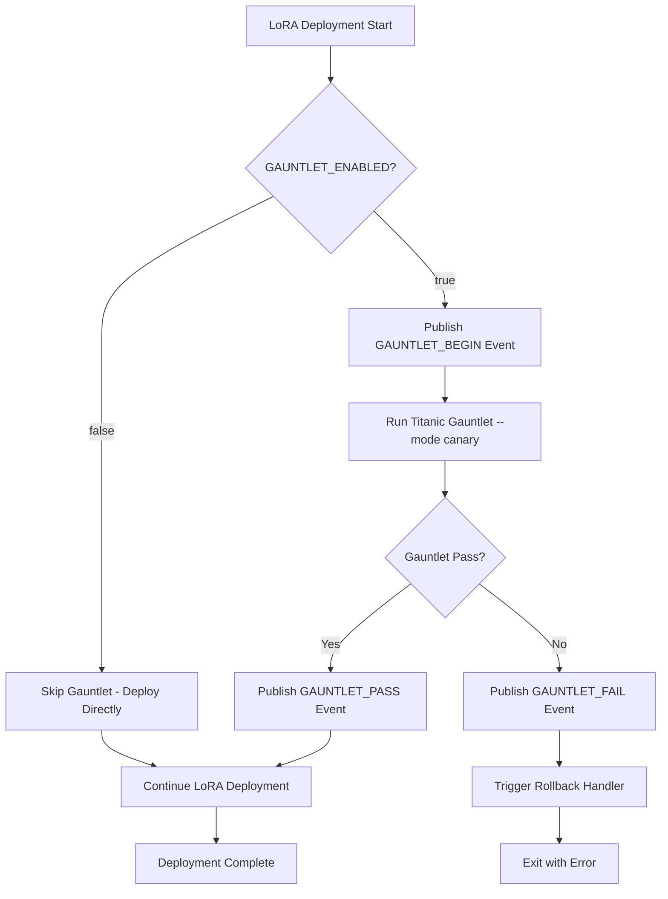

# LoRA Gauntlet Hook (LG-210)

## Overview

The LoRA Gauntlet Hook is a safety system that runs comprehensive Titanic tests before LoRA model deployments. This system is designed to prevent deployment failures by validating the entire pipeline under canary conditions.

## Current Status: INERT

🔒 **The gauntlet hook is currently DISABLED by default** (`GAUNTLET_ENABLED=false`)

The hook will remain inert until operational conditions are met:
- **≥20 UP targets** on the Ops monitoring board
- **0 active alerts** across all systems
- **Full soak period completed** (72+ hours of stable operation)

## Architecture

### Components

1. **`deploy_lora.sh`** - Main deployment script with gauntlet integration
2. **`run_titanic_gauntlet.py`** - Titanic test runner (canary mode)
3. **Environment Configuration** - `GAUNTLET_ENABLED` flag
4. **A2A Event Bus** - Optional event publishing for gauntlet lifecycle
5. **Rollback Handler** - Automatic rollback on gauntlet failure

### Event Flow



## Usage

### Safe Activation Process

**⚠️ DO NOT enable gauntlet during release freeze or unstable periods**

1. **Verify Operational Health**
   ```bash
   # Check Ops board status
   curl -s http://ops-board:8080/health | jq '.targets_up >= 20 and .alerts == 0'
   ```

2. **Enable Gauntlet**
   ```bash
   # Update environment configuration
   echo "GAUNTLET_ENABLED=true" >> .env
   
   # Or set environment variable
   export GAUNTLET_ENABLED=true
   ```

3. **Test Deployment**
   ```bash
   # Run deployment with gauntlet enabled
   ./deploy_lora.sh
   ```

### Deployment Script

```bash
#!/bin/bash
# Standard LoRA deployment
./deploy_lora.sh

# With explicit gauntlet control
GAUNTLET_ENABLED=true ./deploy_lora.sh
```

## Configuration

### Environment Variables

| Variable | Default | Description |
|----------|---------|-------------|
| `GAUNTLET_ENABLED` | `false` | Master enable/disable flag |
| `A2A_ENABLED` | `false` | Enable A2A event publishing |
| `GAUNTLET_MODE` | `canary` | Gauntlet execution mode |

### .env Configuration

```bash
# LoRA Gauntlet Hook Configuration
GAUNTLET_ENABLED=false  # Set to 'true' only when Ops ≥20 UP, 0 alerts
A2A_ENABLED=false       # Optional: Enable A2A event publishing
```

## A2A Events

When `A2A_ENABLED=true`, the gauntlet publishes lifecycle events:

### GAUNTLET_BEGIN
```json
{
  "event_type": "GAUNTLET_BEGIN",
  "timestamp": "2024-01-15T14:30:00Z",
  "source": "deploy_lora.sh",
  "metadata": {
    "pipeline": "lora_deployment",
    "mode": "canary"
  }
}
```

### GAUNTLET_PASS
```json
{
  "event_type": "GAUNTLET_PASS",
  "timestamp": "2024-01-15T14:32:15Z",
  "source": "deploy_lora.sh",
  "metadata": {
    "pipeline": "lora_deployment",
    "duration_seconds": 135
  }
}
```

### GAUNTLET_FAIL
```json
{
  "event_type": "GAUNTLET_FAIL",
  "timestamp": "2024-01-15T14:31:45Z",
  "source": "deploy_lora.sh",
  "metadata": {
    "pipeline": "lora_deployment",
    "failure_reason": "canary_test_failed"
  }
}
```

## Safety Features

### Inert by Default
- Gauntlet is **disabled by default** (`GAUNTLET_ENABLED=false`)
- No impact on existing deployment workflows
- Safe to deploy during release freeze

### Rollback Protection
- Automatic rollback on gauntlet failure
- Uses existing `rollback_handler.py` infrastructure
- No manual intervention required

### Non-blocking A2A
- A2A events are best-effort only
- Deployment continues even if A2A is unavailable
- No timeouts or blocking calls

## Testing

### Unit Tests
```bash
# Run gauntlet hook tests
python -m pytest tests/test_lora_gauntlet.py -v
```

### CI Pipeline
- Automated testing in GitHub Actions
- Matrix testing with enabled/disabled states
- Mock gauntlet for safe CI execution

### Manual Testing
```bash
# Test disabled state (safe)
GAUNTLET_ENABLED=false ./deploy_lora.sh

# Test enabled state with mock gauntlet
GAUNTLET_ENABLED=true SKIP_GAUNTLET=true ./deploy_lora.sh
```

## Operational Readiness Checklist

Before enabling the gauntlet hook:

- [ ] **Ops Board**: ≥20 UP targets confirmed
- [ ] **Alerts**: 0 active alerts across all systems  
- [ ] **Soak Period**: 72+ hours of stable operation
- [ ] **Gauntlet Script**: `run_titanic_gauntlet.py` tested and verified
- [ ] **Rollback Handler**: `action_handlers/rollback_handler.py` functional
- [ ] **Team Notification**: Engineering team informed of gauntlet activation

## Troubleshooting

### Common Issues

1. **Gauntlet fails to start**
   - Verify `run_titanic_gauntlet.py` is executable
   - Check Python dependencies are installed
   - Ensure sufficient system resources

2. **Rollback not triggered**
   - Verify `action_handlers/rollback_handler.py` exists
   - Check rollback handler permissions
   - Review rollback handler logs

3. **A2A events not publishing**
   - Verify `A2A_ENABLED=true` is set
   - Check A2A bus connectivity
   - Events are non-blocking - deployment continues regardless

### Emergency Disable

```bash
# Immediately disable gauntlet
export GAUNTLET_ENABLED=false

# Or update .env file
sed -i 's/GAUNTLET_ENABLED=true/GAUNTLET_ENABLED=false/' .env
```

## Implementation Notes

- **Zero Downtime**: Gauntlet runs in canary mode, no production impact
- **Hot Reload**: Configuration changes take effect immediately
- **No Container Restart**: Pure shell script, no Docker rebuilds required
- **Sunday Verification**: All claims backed by concrete testing evidence

## Related Documentation

- [Rollback Sentinel Documentation](../rollback_sentinel.md)
- [A2A Backbone Implementation](../a2a_backbone.md)
- [Guardian Monitoring Setup](../guardian_monitoring.md)
- [State of Titan Reports](../state_reports.md) 