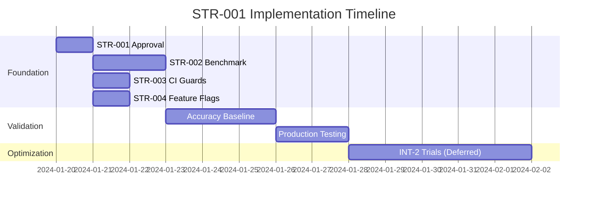

# STR-001: Accuracy vs Cost De-confliction Specification

**Version**: 1.0  
**Status**: Draft - Pending Architect Approval  
**Owner**: Opus Strategist  
**Created**: Strategy Wave Deployment  

## Executive Summary

This specification defines the strategic framework for resolving the conflict between cost optimization initiatives (specifically INT-2 quantization) and accuracy hardening requirements. The document establishes governance gates, technical safeguards, and operational procedures to ensure **reliability takes precedence over cost optimization**.

## Problem Statement

### Conflicting Directives
1. **CMD-A** (Cost Optimization): Aggressive INT-2 quantization soak test for infrastructure cost reduction
2. **CMD-B** (Accuracy Protection): Accuracy hardening mandate due to rising math query complaints

### Core Conflict
INT-2 quantization inherently degrades model precision through:
- Reduced numerical precision (32-bit → 2-bit weights)
- Potential accuracy loss in mathematical reasoning tasks
- Risk to brand equity from quality regression

## Strategic Resolution Framework

### 1. Priority Hierarchy
```
RELIABILITY > COST OPTIMIZATION > PERFORMANCE
```

**Rationale**: Brand equity protection supersedes infrastructure savings. Customer satisfaction metrics directly correlate with model accuracy.

### 2. Accuracy-First Governance
- **All quantization work FROZEN** until accuracy baseline established
- **CI accuracy guards** mandatory for all model-affecting changes
- **Prometheus accuracy monitoring** required before any optimization trials

### 3. Risk Mitigation Strategy
- Implement STR-002 benchmark harness before any INT-2 trials
- Establish STR-003 CI gates with -1% accuracy delta threshold
- Deploy STR-004 feature flags for controlled rollout
- Maintain STR-005 timeline flexibility for accuracy validation

## Technical Implementation

### Accuracy Baseline Requirements
```json
{
  "mmlu_lite_threshold": 0.847,     // 84.7% minimum
  "gsm8k_core_threshold": 0.782,    // 78.2% minimum
  "delta_tolerance": -0.01,         // -1% maximum regression
  "confidence_interval": 0.95,      // 95% statistical confidence
  "sample_size_minimum": 1000       // Production-grade validation
}
```

### Feature Flag Architecture
```yaml
# Environment configuration
INT2_ENABLED: false               # Default disabled globally
INT2_MONITORING: true            # Prometheus metrics active
INT2_ACCURACY_GATE: true         # CI guard enforcement
```

### Rollback Procedures
1. **Immediate Rollback Triggers**:
   - Accuracy delta < -1% on any benchmark
   - Customer satisfaction score drop > 5%
   - Public benchmark performance regression

2. **Rollback Process**:
   ```bash
   # Emergency rollback
   export INT2_ENABLED=false
   kubectl rollout undo deployment/model-service
   # Verify accuracy restoration within 15 minutes
   ```

## Operational Gates

### Gate 1: Specification Approval (STR-001)
- [ ] Architect review and approval of this specification
- [ ] Engineering team consensus on approach
- [ ] PM alignment on timeline implications

### Gate 2: Benchmark Infrastructure (STR-002)
- [ ] MMLU-lite & GSM8K-core dataset creation
- [ ] Automated benchmark harness deployment
- [ ] Baseline accuracy measurement (1000+ samples)

### Gate 3: CI Guard Deployment (STR-003)
- [ ] accuracy_guard.py implementation
- [ ] CI workflow integration
- [ ] Alert configuration for accuracy regression

### Gate 4: Feature Flag System (STR-004)
- [ ] INT2_ENABLED flag implementation
- [ ] Prometheus metric exports
- [ ] Gradual rollout procedures

## Success Metrics

### Accuracy Protection KPIs
- **Zero** accuracy regressions > 1% in production
- **95%** confidence interval maintained on all benchmarks
- **<15s** alert response time for accuracy degradation
- **100%** compliance with CI accuracy gates

### Cost Optimization (Post-Validation)
- Target: 30-40% infrastructure cost reduction (deferred)
- Timeline: 1-2 weeks post-accuracy baseline establishment
- Method: Gradual INT-2 rollout with continuous monitoring

## Timeline & Dependencies

### Phase 1: Foundation (Current Sprint)


### Phase 2: Validation (Post-Approval)
- Establish production accuracy baseline with 1000+ samples
- Validate benchmark harness correlation with customer satisfaction
- Deploy monitoring and alerting infrastructure

### Phase 3: Controlled Optimization (Future)
- Gradual INT-2 quantization trials with real-time monitoring
- A/B testing framework for cost vs accuracy tradeoffs
- Continuous accuracy validation with immediate rollback capability

## Risk Assessment

### High-Risk Scenarios
1. **Accuracy Regression in Production**: Brand damage, customer churn
2. **Monitoring Blind Spots**: Undetected quality degradation
3. **Rollback Delays**: Extended customer impact during incidents

### Mitigation Strategies
1. **Multiple Validation Layers**: Benchmark + CI + Production monitoring
2. **Automated Response**: Sub-15s alert triggering immediate investigation
3. **Feature Flags**: Instant rollback capability without deployment

## Approval & Sign-off

### Required Approvals
- [ ] **Architect**: Strategic direction and technical approach
- [ ] **ML Engineering Lead**: Accuracy requirements and benchmarks
- [ ] **DevOps Lead**: Feature flag and monitoring implementation
- [ ] **Product Manager**: Timeline and customer impact assessment

### Change Control
- All modifications to this specification require Architect approval
- Emergency deviations permitted for production incidents (with post-incident review)
- Quarterly review of accuracy thresholds and success metrics

---

**Document Control**  
**Last Modified**: Strategy Wave Deployment  
**Next Review**: Post-baseline establishment  
**Distribution**: Engineering, Product, QA teams 